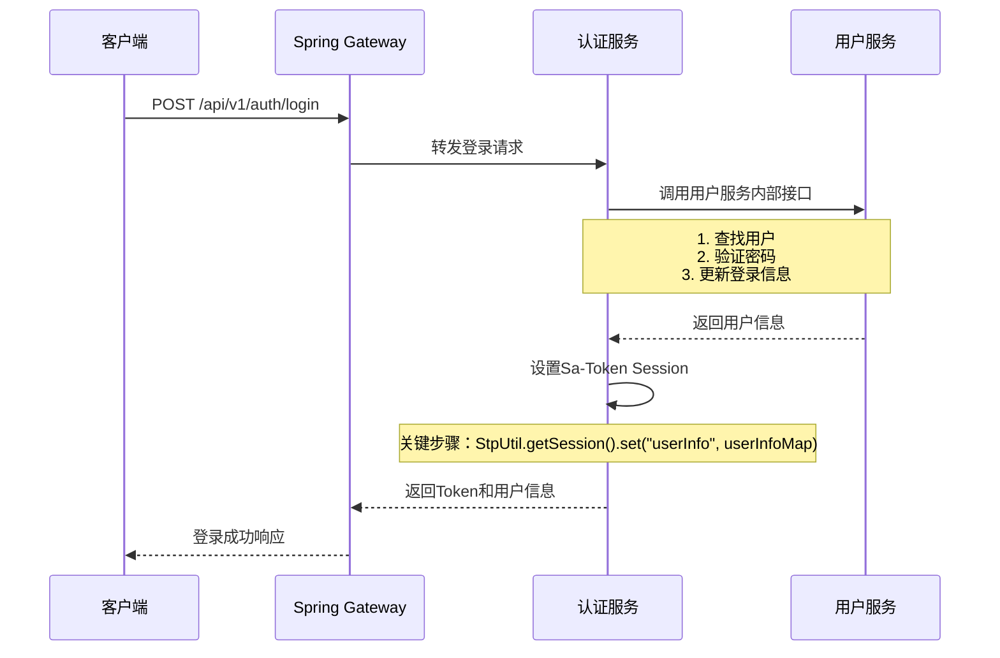

# Sa-Token Session 设置流程说明

## 🎯 核心问题：登录成功后哪里设置Session信息？

在微服务架构中，Sa-Token的Session信息需要在**认证服务**的登录成功后设置，具体位置是认证服务的登录接口中。

## 📋 完整流程

### 1. 用户登录请求流程



### 2. 关键代码位置

#### 认证服务登录接口 (AuthController.java)
```java
@PostMapping("/login")
public ApiResponse<LoginResponse> login(@RequestBody LoginRequest request) {
    // 1. 验证用户身份
    UserInfo userInfo = authService.authenticateUser(request);
    
    // 2. 执行Sa-Token登录
    StpUtil.login(userInfo.getId());
    
    // 3. 【关键】设置Session信息
    setUserSession(userInfo);
    
    // 4. 返回登录结果
    return ApiResponse.success(response, "登录成功");
}

/**
 * 设置用户Session信息 - 核心方法
 */
private void setUserSession(UserInfo userInfo) {
    Map<String, Object> userInfoMap = new HashMap<>();
    userInfoMap.put("user_id", userInfo.getId());
    userInfoMap.put("username", userInfo.getUsername());
    userInfoMap.put("role", userInfo.getRole());
    userInfoMap.put("status", userInfo.getStatus());
    userInfoMap.put("vip_expire_time", userInfo.getVipExpireTime());
    // ... 其他用户信息
    
    // 设置到Sa-Token Session中
    StpUtil.getSession().set("userInfo", userInfoMap);
}
```

### 3. 认证服务调用用户服务流程

#### AuthService.java - 用户认证
```java
public UserInfo authenticateUser(LoginRequest request) {
    // 1. 调用用户服务：根据登录标识查找用户
    UserByIdentifierRequest findRequest = new UserByIdentifierRequest();
    findRequest.setIdentifier(request.getIdentifier());
    ApiResponse<UserByIdentifierResponse> findResult = userServiceClient.findUserByIdentifier(findRequest);
    
    // 2. 调用用户服务：验证密码
    UserPasswordVerifyRequest verifyRequest = new UserPasswordVerifyRequest();
    verifyRequest.setUserId(userInfo.getId());
    verifyRequest.setPassword(request.getPassword());
    ApiResponse<Boolean> verifyResult = userServiceClient.verifyPassword(verifyRequest);
    
    // 3. 返回用户信息供设置Session使用
    return userInfo;
}
```

#### UserServiceClient.java - Feign接口
```java
@FeignClient(name = "user-service", path = "/api/v1/users/internal")
public interface UserServiceClient {
    
    @PostMapping("/find-by-identifier")
    ApiResponse<UserByIdentifierResponse> findUserByIdentifier(@RequestBody UserByIdentifierRequest request);
    
    @PostMapping("/verify-password")
    ApiResponse<Boolean> verifyPassword(@RequestBody UserPasswordVerifyRequest request);
    
    @PostMapping("/update-login-info/{userId}")
    ApiResponse<Boolean> updateLoginInfo(@PathVariable("userId") Integer userId);
}
```

### 4. 用户服务内部接口 (已存在)

您的用户服务已经提供了所需的内部接口：

```java
// 用户服务内部接口 - app/domains/users/async_router.py

@router.post("/internal/find-by-identifier")
async def find_user_by_identifier_internal(request: UserLoginIdentifierRequest, db: AsyncSession = Depends(get_async_db))

@router.post("/internal/verify-password") 
async def verify_password_internal(request: UserPasswordVerifyRequest, db: AsyncSession = Depends(get_async_db))

@router.post("/internal/update-login-info/{user_id}")
async def update_login_info_internal(user_id: int, db: AsyncSession = Depends(get_async_db))
```

### 5. Session信息的使用

#### StpInterfaceImpl.java - 权限获取
```java
@Override
public List<String> getPermissionList(Object loginId, String loginType) {
    // 从Session中获取用户信息
    Object userInfoObj = StpUtil.getSessionByLoginId(loginId).get("userInfo");
    
    if (userInfoObj instanceof Map<?, ?> userInfo) {
        String role = (String) userInfo.get("role");
        String status = (String) userInfo.get("status");
        // 根据角色和状态分配权限
        // ...
    }
}
```

## 🔧 实施步骤

### 步骤1：创建认证服务
在您的项目中创建独立的认证服务，包含：
- AuthController - 登录、登出等接口
- AuthService - 业务逻辑
- UserServiceClient - 调用用户服务的Feign客户端

### 步骤2：配置Feign客户端
```yaml
# application.yml
spring:
  cloud:
    openfeign:
      client:
        config:
          user-service:
            url: http://localhost:8000  # 用户服务地址
```

### 步骤3：设置Session信息
在登录成功后调用 `setUserSession()` 方法设置用户信息到Sa-Token Session中。

### 步骤4：验证权限系统
确保StpInterfaceImpl.java能正确从Session中获取用户信息并分配权限。

## 🚨 注意事项

### 1. Session存储
建议使用Redis存储Session信息：
```yaml
# Sa-Token配置
sa-token:
  token-name: satoken
  timeout: 2592000
  activity-timeout: -1
  is-concurrent: true
  is-share: true
  dao-type: redis
```

### 2. 用户信息结构
确保设置到Session中的用户信息结构与StpInterfaceImpl.java中期望的结构一致：
```java
Map<String, Object> userInfoMap = new HashMap<>();
userInfoMap.put("user_id", userInfo.getId());           // 必需
userInfoMap.put("username", userInfo.getUsername());     // 必需
userInfoMap.put("role", userInfo.getRole());            // 必需
userInfoMap.put("status", userInfo.getStatus());        // 必需
userInfoMap.put("vip_expire_time", userInfo.getVipExpireTime()); // VIP权限需要
```

### 3. 服务间调用
- 用户服务的内部接口 (`/api/v1/users/internal/**`) 在Gateway中完全放行
- 认证服务通过Feign调用用户服务
- 确保服务发现和负载均衡配置正确

### 4. 错误处理
- 实现Feign客户端的降级处理
- 处理用户服务不可用的情况
- 记录详细的日志便于排查问题

## 📖 总结

**核心要点**：
1. **Session设置位置**：认证服务的登录接口中
2. **关键方法**：`StpUtil.getSession().set("userInfo", userInfoMap)`
3. **数据来源**：通过Feign调用用户服务的内部接口获取用户信息
4. **权限使用**：StpInterfaceImpl.java从Session中获取用户信息进行权限分配

这样设计确保了微服务之间的职责分离，认证服务负责认证和授权，用户服务负责用户数据管理。
